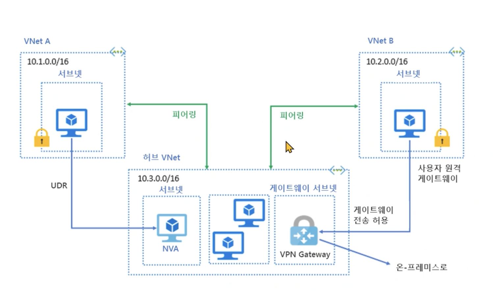

AZ-104 Day #2
===================

### Notes
- 자료 공유 (Onedrive)
    > https://1drv.ms/u/s!AmlADRmU8M8uk_Zx845G11GdHVqp1A?e=QluzWB

- 추가 학습 자료

    > ### DOCS
    > https://learn.microsoft.com/ko-kr/docs/
    > ### CERTIFICATION
    > https://learn.microsoft.com/ko-kr/certifications/
    > ### Learn Profile
    > https://learn.microsoft.com/ko-kr/users/me

---
### Azure Portal
* 애저 포탈의 알림 아이콘은 **구독** 수준의 Event 정보를 제공
* Activity Log 서비스로 들어가면 발생한 이벤트를 딜레이 없이 조회 가능

---
### Azure System CLI Tools

* Powershell -> 객체 기반 컨트롤
* Azure CLI -> 텍스트(json) 기반 컨트롤

---
### ARM Template
> JSON, Bicep을 통해 리소스 배포 자동화
* 멱등성을 보장

https://learn.microsoft.com/en-us/samples/browse/?expanded=azure&products=azure-resource-manager 을 통해 public 으로 공유된 인프라 구조를 가져와서 구성할 수 있음.

Azure QuickStart 템플릿을 통해 누군가가 사전구성해둔 템플릿을 사용할 수 있음.

> Bicep 파일을 통해 템플릿을 구성할 경우 장점
> 1. 객체 형식
> 2. 구문이 더 간결하고 읽기 쉬움
> 3. InteliSense 확장 기능 지원
>   
> https://docs.microsoft.com/azure/azure-resource-manager/bicep/overview?tabs=bicep

---
### 가상 네트워크 관리
* 가상 네트워크 하위에는 **가상 머신** 과 **사설 IP 대역을 갖는 Subnet** 만이 소속될 수 있음.
* 가상 네트워크가 외부와 통신하기 위해서는
1. Public IP
2. NAT
3. JumpBox
4. Bastion (배스천)
5. Serial Port, Run Command

주소 공간 겹쳐서는 안되며, 최소 하나의 서브넷을 설정해야 함.

---
### Azure DNS에서 도메인 호스팅
> #### Azure DNS 란?   
> ★ 머시기임

---
### ASG, NSG
ASG는  NIC 와 같은 네트워크 자원들을 그룹화하여 묶어놓는 기능
NSG는 IP, ASG 등으로 표현된 Source와 Destination 그리고 TCP, UDP 등 여러 프로토콜을
기반으로 인-아웃바운드 방화벽 규칙을 설정하여 **Subnet** 단위로 적용

---
### 가상 네트워크

#### Subnet
- Defualt 로 설정한 범위 내에서 더 작게 Subnet 집합을 잘라낼 수 있음.

---
### 사이트간 연결 관리

#### VNET 피어링 구성

> 가상 네트워크 간의 연결을 구성할 때 사용   
> 두 개의 가상 네트워크를 연결

> 동일 지역 내에서의 연결 뿐만 아니라, 서로 다른 지역의 두 가상 네트워크간에서도 연결이 가능하다.
> 미국 리전에 존재하는 Vnet과 한국 리전에 존재하는 Vnet도 연결을 할 수 있다.

> 연결된 네트워크는 Azure 백본을 사용함
> * 거치는 네트워크 레이어의 개수가 줄어듦 (Overhead 감소)
> * 데이터 전송간 격리성이 좋아짐

VNET 피어링은 단순히 **연결** 만을 해주는 것.
> 같은 스위치에 물리는 개념? LAN + LAN 을 연결해주는 느낌   
> 즉, 연결할 두 네트워크 간에는 서로 사용하는 IP 대역이 달라야 함.

가상 어플라이언스(?) 를 통해 중앙 허브식 구성으로 여러 VNET에 걸친 라우팅을 수행할 수 있음.

> 각각의 VNET에는 UDR(User-Defined Route) 를 설정하여, 피어링 한 다리 너머의 네트워크들에 대해, 어디로 트래픽을 보낼지 명시해두어야 함.

---
### Network Routing
Azure 리소스 중에는 'Route Table' 이라는 객체가 있음.
해당 객체를 사용하면 가상 네트워크에 정의된 라우팅 테이블을 Override 함.
해당 객체의 설정 내에서 테이블을 적용할 **서브넷들** 을 선택하여 라우팅을 적용.

---
### Service Endpoint
가상 네트워크의 기능 중 하나
어떤 **서브넷** 에 **기존에 네트워크에 속해 있지 않은 다른 리소스 / 서비스** (네트워크 스토리지 등) 연결한다.

이렇게 추가된 **리소스** 에 연결된 **서브넷** 으로 부터의 접근을 허용해주면, **해당 서브넷에 속한 리소스**들이 **

---
### Private Link
서비스 엔드포인트로 연결하더라도, 도메인 주소를 통해 접근하게 되면 공인 IP를 통해 접근을 시도 하게 됨   
즉, 트래픽이 출발지로부터 중간의 수많은 미들웨어 서비스들을 지나 다시 원하는 리소스로 돌아가는 루트 사이의 모든 방화벽 / 보안 정책을 신경써야 한다.   

프라이빗 링크를 사용하면 공인 IP를 추적함으로써 발생하는 트래픽 경로의 오버헤드를 없애버릴 수 있다.   

프라이빗 링크를 연결받지 않은 다른 Host들은 기존의 공인 IP를 DNS로 부터 전달받아 변화가 없지만,
프라이빗 링크를 연결받은 서브넷의 Host들은 **사설 IP** 대역 (연결된 리소스는 해당 서브넷의 여분 IP중 하나를 부여받게 됨)을 통해 접근을 시도. 즉, Azure 백본망을 사용하여 접근하게 된다.
   
이를 통해   
1. 긴 경로를 거치면서 신경써야 했던 수많은 정책에 대한 Focus 범위가 줄어듦
2. 긴 경로로 인해 발생하는 트래픽의 Overhead 감소

정도의 이점을 얻을 수 있다.

---
### Azure Load Balancer
로드 밸런서는 퍼블릭, 내부 로드밸런서로 나뉘며 내부 로드밸런서는 **Private Link Service** 로도 사용됨. (문제로 나온대!)

||어플리케이션 게이트웨이|프론트 도어|로드밸런서|트래픽 매니저|
|---|---|---|---|---|
|레이어계층|L7|L7|L4|DNS|
|프로토콜|HTTP, HTTPS, HTTP2| HTTP, HTTPS, HTTP2|TCP, UDP|ALL|
|보안|WAF|WAF, NSG|NSG||
|프라이빗|예||예||
|전역||예||예|
|환경|애저, 애저이외 클라우드, 온프레미스|좌동|애저|애저, 애저이외 클라우드, 온프레미스|

부하 분산 장치(로드 밸런서)는 결국 앞단(프론트엔드)으로 부터 트래픽을 받아서 뒷단의 리소스(백엔드풀)로 전달하는 것이 목적임   
그리고 이러한 전달 사이에 부하 전달 규칙을 지정하여 해당 규칙에 따라 트래픽을 분산하게 됨.

* 세션 지속성
> 없음, Only IP, IP 와 프로토콜 종류 세가지를 선택적으로 동일 VM 에 트래픽이 전달되도록 설정할 수 있음.

* NAT
> 로드밸런서에 NAT를 적용할 수 있음.
> 얘도 사실상 네트워크 스위치를 진화시킨 개념이라 NAT의 기능을 **똑같이** 모사할 수 있음.