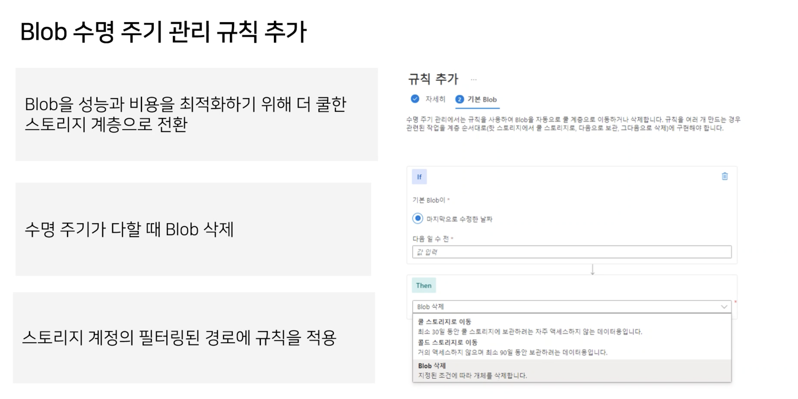

AZ-104 Day #3
===================

### Notes
- 자료 공유 (Onedrive)
    > https://1drv.ms/u/s!AmlADRmU8M8uk_Zx845G11GdHVqp1A?e=QluzWB

- 추가 학습 자료

    > ### DOCS
    > https://learn.microsoft.com/ko-kr/docs/
    > ### CERTIFICATION
    > https://learn.microsoft.com/ko-kr/certifications/
    > ### Learn Profile
    > https://learn.microsoft.com/ko-kr/users/me

---
### FrontDoor
> Inter-리전에 걸쳐 로드밸런싱 수행 := CDN

---
### 부하 부산 장치 (Load Balancer)
TCP Health Probe 지원   
프론트엔드 IP 로 들어오는 트래픽을 백엔드풀에 속한 장치들로 밸런싱   
-> 백엔드 풀에 일부 장비에서 장애 발생시 자동으로 장애가 없는 장비로 라우팅

하나의 단일 리전 내에서만 사용 가능함

---
### Application Gateway
-> URL 경로 / 사이트 기반 라우팅

하나의 단일 리전 내에서만 사용 가능함

|경로|사이트|
|--|--|
|aaa.com/images/*, aaa.com/videos/*|aaa.com, bbb.com|

사용자에게 노출이 되면 안되나, 개발자들이 봐야 하는 메시지 들의 경우
그 경계를 보통 Application Gateway 로 정하는 경우가 많음

설정시에 가상 네트워크를 하나 지정하고, 그 네트워크 내부의 서브넷 영역을 하나 요구하게 된다.
다른 서비스들이 사용하는 서브넷을 고를수는 있으나, IP 풀이 부족해주고 꼬일 수 있으므로
별도의 서브넷을 추가로 생성하여 할당해주는 것이 좋다.

---
### Storage
> 모든 개체에는 계정 이름 및 스토리지 형식에 따른 고유한 HTTPS URL 주소가 있음.

#### Azure Storage Service

애저 컨테이너 - Blob -> 텍스트및 이진 데이터용 개체저장소 
애저 테이블 - Entity -> SQL 
애저 큐 - Message -> 애플리케이션 구성요소간의 안정적인 메시징을위한 메시징 저장소 
애저 파일 - Directory -> 클라우드 또는 온-프레미스 배포를 위한 관리형 파일 공유 (SMB)

#### 스토리지 계정 종류

* 표준 범용 v2 : 기본
* 프리미엄 블록 Blob : 기본 + Blob 최적화
* 프리미엄 페이지 Blob : 
* 

#### 복제 전략

#### 스토리지 엔드포인트 보호

#### Blob 스토리지

#### 스토리지 액세스 계층
* 핫 계층 - 자주 액세스하거나 수정하는 데이터를 저장하는 데 최적화된 온라인 계층입니다. 핫 계층은 스토리지 비용이 가장 높지만 액세스 비용은 가장 낮습니다.   
* 쿨 계층 - 자주 액세스하거나 수정하지 않는 데이터를 저장하는 데 최적화된 온라인 계층입니다. 쿨 계층의 데이터는 최소 30일 동안 저장해야 합니다. 쿨 계층은 핫 계층에 비해 스토리지 비용이 낮고 액세스 비용은 높습니다.   
* 콜드 계층 - 거의 액세스하거나 수정하지 않지만 여전히 빠른 검색이 필요한 데이터를 저장하는 데 최적화된 온라인 계층입니다. 콜드 계층의 데이터는 최소 90일 동안 저장해야 합니다. 콜드 계층은 쿨 계층에 비해 스토리지 비용이 낮고 액세스 비용은 높습니다.   
* 보관 계층 - 거의 액세스하지 않고 요구되는 대기 시간(시간 기준)이 유연한 데이터를 저장하는 데 최적화된 오프라인 계층입니다. 보관 계층의 데이터는 최소 180일 동안 저장해야 합니다.
- 수명 주기 관리를 통해 자동 액세스 계층 변환이 가능

#### 공유 액세스 서명 - SAS (Share Access Signature)

> 한번 발급되면 회수가 안됨

그래서 스토리지 **액세스 정책** 을 기반으로 SAS 를 발급하면
**정책 조건의 변경** 을 통해 접근 권한을 회수할 수 있음

#### Azure File 과 Blob 의 차이
|Azure File|Azure Blob|
|--|--|
|주로 B2B|주로 B2C|
|리소스 대시보드 내에 SAS 설정 블레이드가 없음 SAS 키 만드려면 스토리지 Explorer 에서 파일 오른쪽 ... 눌려서 만들수 있음||

#### Recovery Service Vault

백업 관련   
삭제하기 어려움!

#### File Copy

#### 정적 웹페이지

스토리지 어카운트는 정적 웹 사이트를 제공함.   
> -> 정적 웹사이트 기능을 활성화 하면 컨테이너 목록에 **$web** 컨테이너가 생성됨.   
-> 해당 컨테이너에 정적으로 빌드된 웹사이트 파일들을 업로드하면, 스토리지 어카운트가 웹사이트를 자동으로 제공

---
### 가상 머신

#### 가상 머신 확장 집합
로드 밸런서 + 공용 IP + 백엔드 풀 구성 + 오토 스케일링   
전 부 자동으로 뚝딱 만들어줌

---
### PaaS 컴퓨팅 옵션 관리

---
### Notice
> 뭔가 이름을 적을때는 소문자로 작성하는 것을 추천

